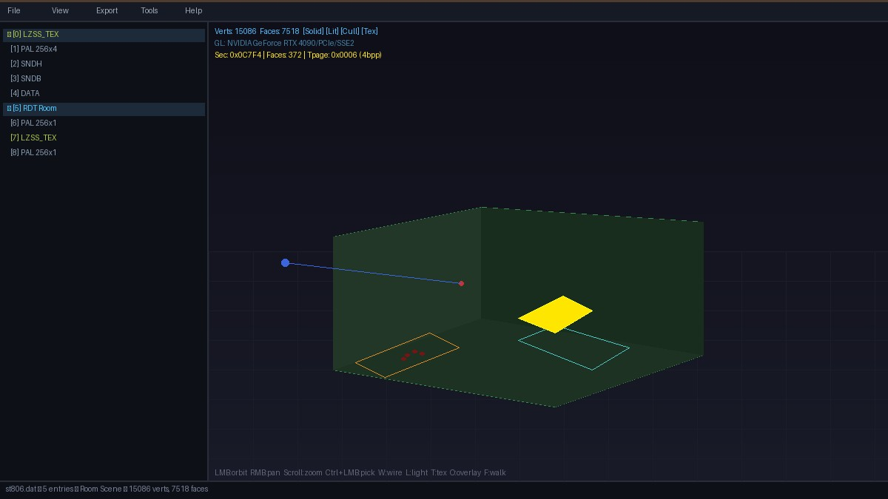

# Experimental GLB animation export modification

See [EXPORTING.md](EXPORTING.md) for the new exporter, Windows build instructions, validation, and known limitations. Upstream documentation follows.

<div align="center">

# 🦖 RaptorScope

**A native Win32 + OpenGL viewer and editor for Dino Crisis (1999 PC) game archives**

[](https://unlicense.org/)
[](https://www.microsoft.com/windows)
[](https://isocpp.org/)
[](https://www.opengl.org/)
[](#requirements)
[](https://www.anthropic.com/)
[](#architecture)

---



*3D room viewer with textured PSX geometry, overlay visualization, walk-through mode, and object picking*

</div>

---

## Overview

RaptorScope is a comprehensive reverse-engineering toolkit for **Dino Crisis** (PC, 1999). It parses the game's proprietary `.DAT` archive format and provides interactive viewers for every data type: room geometry, character models, textures, palettes, audio, and SCD bytecode scripts.

The tool reconstructs the PSX GPU rendering pipeline in software — including 4bpp/8bpp CLUT-indexed textures, VRAM deswizzling, BGR555 color conversion, semi-transparency (STP) blending, and per-pixel palette lookup — to produce accurate previews of how assets appear on original hardware.

## Features

### Archive Browser
- Open and browse `.DAT` archive files with automatic entry type detection
- Export individual entries or entire archives to disk
- Import replacement entries for modding workflows
- Drag-and-drop file loading

### 3D Room Viewer
- **Full room geometry** reconstructed from RDT (Room Data Table) files, including the two rooms that store their RDT uncompressed (ST50B, ST60E)
- **Mixed BPP rendering**: 4bpp and 8bpp textures coexist in a single atlas via 2D sparse sub-palette allocation
- **SCD script walker**: Parses bytecode to extract camera shots (0x4C, and its short form 0x2E), entity spawns (0x42), item pickups (0x5B), and scene lights (0x3A)
- **Trigger zones**: Every 0x28 zone in the script area is found by scanning it, not by the walk, so zones set after an 0x01 (such as ST103's door triggers) are shown
- **Scripted placement**: The room is built the way the game builds it — only the sections its scripts place into model slots are drawn. Placements (0x23, and item pickup zones 0x28 type 4) are found by scanning the whole script area, then later script writes to the slot (0x2A, 0x36, 0x37) adjust position and rotation, e.g. lifting items onto desks
- **Item pickup models**: Type-4 zones (0x28) put their item model at the zone centre, as the game does
- **Unplaced sections (H key)**: Sections the game stores but never places (unused leftovers, such as an unused DDK in ST103) are hidden by default; **H** shows them tinted magenta at their raw positions
- **Outdoor scenes**: Sky domes and sea planes out to ±32,000 units are kept; the camera frames the walkable area and the far clip plane reaches the sky
- **PSX-accurate transparency**: 0x0000 masking, 0x8000 transparent black, STP semi-transparency for 4bpp decals (blood splatters)
- **PSX vertex color modulation**: 2x scaling to match hardware `(tex * vtx) / 128` behavior

### Walk-Through Mode
- First-person camera with WASD movement, mouse look, jump, and sprint
- Collision detection via walkable grid built from ptr[1] collision rects
- Noclip fly mode (P key) for unrestricted exploration
- Spawn at character placement points from SCD data
- Fireball projectiles (LMB) with physics and floor bounce

### Object Picking
- **Ctrl+Click** any face in the 3D viewport to select its material group
- Highlights all faces sharing the same tpage + CLUT combination
- HUD displays section offset, face count, tpage decode (BPP, ABR, TX, TY), CLUT coordinates, and bounding box
- Essential for debugging texture issues and identifying specific geometry

### Overlay Visualization
Toggle with **O key** to see all parsed SCD data as colored wireframe overlays:

| Color | Source |
|---|---|
| Green | Collision rectangles (ptr[1]) |
| Orange | Zone type 0 (0x28) |
| Light Blue | Zone type 1 (0x28) |
| Yellow | Zone types 2/3 (0x28) |
| Cyan | Item pickup zones, type 4 (0x28) |
| Purple | Floor elevation zones (ptr[6]) |
| Violet | Camera cut zones (ptr[2]) |
| Gold | Scene lights (0x3A + ptr[0]) |
| Blue dot | Camera eye position (0x4C, 0x2E) |
| Red dot | Camera target (0x4C, 0x2E) |
| White diamond | Item pickup (0x5B) |
| Orange dot | Character spawn (0x20) |

Zones and rectangles carry only X/Z, so they are drawn on the room's floor: the height of the upward-facing horizontal faces that lie under them (a ceiling never counts, even when it has more geometry than the floor, as in ST105).

### Character Model Viewer
- EMD model parsing with skeletal hierarchy
- Bone visualization and animation playback
- Per-part mesh rendering with UV mapping

### Texture and Palette Viewer
- 4bpp, 8bpp, and 16bpp texture preview
- **Face-based decoding** for room textures: each area is decoded with the bit depth and CLUT its faces actually use, so pages that mix 4bpp and 8bpp display correctly (**C** switches to the single-CLUT view)
- Multi-row CLUT visualization with sub-palette cycling (**Up/Down**)
- VRAM deswizzle (64x32 block tiling) for raw PS1 texture data
- UV editor overlay for texture coordinate inspection

### Audio Player
- VAG ADPCM decoding with waveform visualization
- Multi-sample SNDB bank playback at each sample's own rate, derived from the Gian (SNDH) tone that plays it; the rate is shown per sample and used for WAV export
- SEQ music playback using the bank's instruments at the correct pitch
- Note: the sound banks inside room files are the original PlayStation samples. The PC game plays its own higher-quality WAVs from `Sound\SE` (and music from `Sound\BGM`), which RaptorScope opens directly

### Save File Editor
- Reverse-engineered save file format with inventory editing
- Event flag bit patterns for room teleportation
- Item slot manipulation

### Additional Features
- **Dark theme**: Automatic Windows 10/11 dark mode detection with dark title bar
- **Export formats**: OBJ, SMD (Source engine), GLB (characters with animations, and textured rooms), BMP texture export
- **Hex viewer**: Raw binary inspection of any archive entry with offset display
- **Software renderer fallback**: GDI Generic compatibility for VMs without GPU acceleration
- **F11 render mode cycling**: Normal / VM GPU / Software rendering

## Building

### MinGW (Recommended)

```bash
cd raptorscope
mingw32-make -f Makefile.mingw
```

Debug build with symbols:
```bash
mingw32-make -f Makefile.mingw DEBUG=1
```

### Code::Blocks

Open `projects/codeblocks/RaptorScope.cbp` and build (F9).

### Visual Studio 2022

Use the solution in `projects/vs2022/` or create a new project importing all `src/**/*.cpp` and `include/` as the include path. Link against `opengl32.lib`, `glu32.lib`, `winmm.lib`, `comctl32.lib`, `comdlg32.lib`, `shlwapi.lib`.

## Requirements

| Requirement | Details |
|---|---|
| **Compiler** | MinGW GCC, MSVC 2015+, or any C++ compiler (pre-C++11 compatible) |
| **OS** | Windows XP SP3 or later |
| **Graphics** | OpenGL 1.1+ (uses display lists and immediate mode) |
| **Dependencies** | **None** — pure Win32 API + OpenGL, no external libraries |

The entire project compiles with zero external dependencies. All format parsing, decompression, audio decoding, and rendering is implemented from scratch.

## Architecture

```
raptorscope/
├── include/
│   ├── core/           Types, LZSS, color conversion, audio decoding
│   ├── formats/        DAT archive, texture, mesh/RDT, TIM/IMD, save files
│   ├── ui/             Application state, panel definitions
│   └── ext/            ddraw_ext.h (optional DirectDraw overlay framework)
├── src/
│   ├── core/           LZSS decompressor, BGR555 to RGBA, VAG/SEQ audio
│   ├── formats/        Archive parser, VRAM deswizzle, room/EMD mesh builder
│   ├── ui/             Win32 window framework, OpenGL panels, hex/image/3D/audio
│   └── main.cpp        WinMain entry point
├── res/                Application icon, RC script, XP manifest
├── projects/           IDE project files (Code::Blocks, VS2022)
├── Makefile.mingw      GNU Make build script
├── LICENSE             The Unlicense (public domain)
└── README.md           This file
```

**~32,000 lines of C++** across 30 source files. Key modules:

| Module | Lines | Purpose |
|---|---|---|
| `panels.cpp` | 6,100 | OpenGL 3D viewer, walk mode, object picking, all panel rendering |
| `app.cpp` | 3,600 | Archive loading, texture atlas builder, mesh pipeline orchestration |
| `mesh.cpp` | 3,300 | RDT room parsing, SCD script walker, mesh instancing, overlay extraction |
| `save_editor.cpp` | 1,800 | Save file reverse engineering and editing UI |
| `panels.h` | 540 | ViewerPanel3D state: camera, walk mode, atlas, picking, animation |
| `mesh.h` | 440 | Mesh/overlay structs, section xforms, collision rects, camera entries |

## Format Documentation

### DAT Archive Structure

The `.DAT` file begins with a 2048-byte header containing 16-byte entries:

| Offset | Size | Field |
|---|---|---|
| 0x00 | 4 | Entry type (0=Data, 1=Texture, 2=Palette, 3=Sound header (Gian), 4=Sound bank (VAG), 5=Sequence, 7=LZSS, 8=LZSS Texture) |
| 0x04 | 4 | Compressed/raw size in bytes |
| 0x08 | 2 | VRAM X position (halfwords) |
| 0x0A | 2 | VRAM Y position |
| 0x0C | 2 | Width (halfwords) |
| 0x0E | 2 | Height (rows) |

Entry data follows at 2048-byte aligned offsets after the header.

### RDT Room Format

Type 7 entries decompress via LZSS to an RDT structure (ST50B and ST60E store theirs uncompressed as a type 0 entry):

- **Header**: 7 PSX pointers (base `0x80100000`) to data sections
- **ptr[0]**: Static room lights + ambient RGB
- **ptr[1]**: Collision rectangle groups (16 groups x variable rects)
- **ptr[2]**: Camera cut trigger zones
- **ptr[3]**: Camera thread zones
- **ptr[5]**: SCD bytecode (room initialization scripts)
- **ptr[6]**: Floor elevation zones
- **Mesh sections**: Starting at offset 0x1C, sequential 12-byte headers (tri_ptr, quad_ptr, tri_count, quad_count). Sections are only drawn where a script places them; some rooms carry unused leftovers

### SCD Bytecode

The room initialization script (ptr[5]) uses a multi-threaded virtual machine:

- **Thread table**: Array of u32 offsets from SCD base; the first offset / 4 is the thread count
- **Key opcodes**: 0x20 (character spawn), 0x23 (section instance), 0x28 (zone definition), 0x2E (camera eye + target, short form of 0x4C), 0x3A (scene light), 0x42 (entity spawn), 0x4C (camera entry), 0x5B (item pickup)
- **Opcode 0x23** (32 bytes): Places a mesh section into a model slot at a world position with rotation and render mode. Verified against `sub_426806` in DINO.exe; the opcode dispatch table starts at VA `0x006576A0` (the two words before it are 0 and 1)
- **Opcode 0x28** (size by type): a zone's four XZ corners at +4..+19; a real zone repeats its type at +20 and has 1 at +23, which no other 0x28 byte in the scripts does
- **Opcode 0x28 type 4** (44 bytes): Item pickup zone. Its model (slot at +34, section at +36) is placed on the floor at the zone centre (`sub_426DFC` → `sub_448E3B`) and spins while the item is there
- **Work target**: 0x22 03 `<slot>` selects a model slot; 0x2A sets one of its fields (3/4/5 = x/y/z, 6/7/8 = rotation, via `sub_47416C`), 0x36 sets x/y/z and 0x37 the rotation
- **Control flow**: 0x0C (unconditional jump), 0x0E (conditional relative jump), 0x04 (end of thread; every thread finishes with `04 00 00 00`). 0x01 and 0x0A are 4-byte opcodes that scripts continue past; decoding each script straight through with the opcode sizes lands exactly on the next script in every room. Message text follows the last thread in the same block

### PSX Transparency Rules

The tool implements the PSX GPU transparency pipeline:

| BGR555 Value | STP Bit | Context | Alpha | Behavior |
|---|---|---|---|---|
| `0x0000` | 0 | Any | 0 | Pixel masked (not drawn) |
| `0x8000` | 1 | Any | 0 | STP black = effectively transparent |
| STP=1 + color | 1 | 4bpp sub-palette | 128 | Semi-transparent decal (blood) |
| STP=1 + color | 1 | 8bpp palette | 255 | Default VRAM state, NOT transparency |
| STP=0 + color | 0 | Any | 255 | Fully opaque |

### Texture Atlas

The tool composites all archive textures into a single OpenGL atlas using 2D sparse allocation:

- Each unique `(CLUT_row, sub_palette)` pair gets exactly one 512-pixel-tall slice
- 8bpp and 4bpp rendering use **separate slots** (65 per row: slot 0 = 8bpp, slots 1-64 = 4bpp sub-palettes)
- This prevents 4bpp/8bpp collision when a 4bpp face has CLUT X equal to the palette base X
- Typical rooms use 10-40 slices instead of the theoretical maximum, keeping atlas height within GPU texture size limits

## Keyboard Shortcuts

### 3D Viewer (Orbit Mode)
| Key | Action |
|---|---|
| **LMB drag** | Orbit camera |
| **RMB drag** | Pan camera |
| **Scroll** | Zoom |
| **Ctrl+LMB** | Pick object (select material group) |
| **W** | Toggle wireframe |
| **L** | Toggle lighting |
| **T** | Toggle textured rendering |
| **V** | Toggle vertex colors |
| **C** | Toggle backface culling (see-through room faces such as fences and the signs painted on them are always drawn from both sides, as the game does) |
| **O** | Toggle overlay visualization |
| **H** | Show/hide unplaced (unused) room sections |
| **I** | Toggle room scene lights |
| **N** | Toggle vertex normal display |
| **G** | Toggle ground grid |
| **F** | Enter walk-through mode |
| **R** | Reset camera to default |
| **U** | Open UV editor |
| **Esc** | Clear pick selection |
| **F2** | Toggle HUD info |
| **F11** | Cycle render mode (Normal / VM / Software) |

### Walk-Through Mode
| Key | Action |
|---|---|
| **WASD** | Move |
| **Mouse** | Look |
| **Shift** | Sprint |
| **Space** | Jump |
| **P** | Toggle noclip fly mode |
| **LMB** | Shoot fireball |
| **Esc / F** | Exit walk mode |

## AI Disclosure

> **This project was developed entirely using [Anthropic's Claude Opus 4.6](https://www.anthropic.com/) large language model.**
>
> All source code — including the Win32 application framework, OpenGL rendering pipeline, PSX format reverse engineering, SCD bytecode parser, texture atlas system, LZSS decompressor, VAG audio decoder, save file editor, and every feature described in this README — was written by Claude through iterative conversation with a human collaborator providing direction, test data, and visual feedback.
>
> **Human collaborator (Corey) provided:**
> - Game binary files (DINO.exe, .DAT archives) for analysis
> - Screenshots and descriptions of rendering issues
> - Domain knowledge of PSX hardware behavior and Dino Crisis internals
> - Feature requests, bug reports, and visual QA
>
> **Claude Opus 4.6 provided:**
> - All C++ source code (~32,000 lines)
> - Binary format reverse engineering and struct definitions
> - DINO.exe disassembly analysis (SCD dispatch tables, GPU render modes, model table structures)
> - PSX GPU emulation logic (CLUT indexing, STP transparency, VRAM deswizzling, vertex color modulation)
> - 2D sparse texture atlas architecture
> - This README and all documentation
>
> Later fixes (uncompressed rooms, face-based texture decoding, VAG playback rates, scripted room placement and outdoor geometry) were made with Claude Opus 5.5 via Claude Code, using the same workflow.

## Acknowledgments

- **Capcom** — Dino Crisis (1999), one of the great survival horror games
- **Anthropic** — Claude Opus 4.6 AI model used for all development
- The Dino Crisis modding and reverse engineering community

## License

This project is released into the **public domain** under [The Unlicense](LICENSE). You are free to use, modify, distribute, and build upon this work for any purpose without restriction.

---

<div align="center">

*"An experiment in AI-assisted game reverse engineering"*

**[Dino Crisis](https://en.wikipedia.org/wiki/Dino_Crisis) (c) 1999 Capcom. This tool is an independent fan project for preservation and modding purposes.**

</div>
